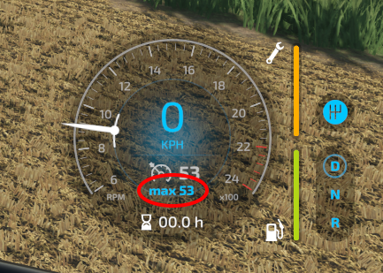
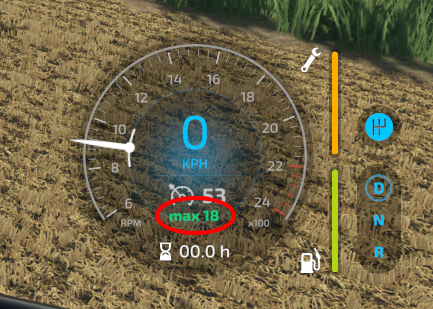

Für eine deutsche Beschreibung, siehe unten.

# Drive Lever for Farming Simulator 22

The mod allows to configure a joystick as a drive lever similar to the ones modern tractors use for acceleration/deceleration instead of a pedal. 

Download can be found on the [releases page](https://github.com/JanCraymer/FS22_DriveLever/releases).

## Current Status

The mod is currently in development. I will upload versions as pre-release that work on my machine. Feel free to test them out and please report any issues you come across.
At the moment I am only able to test this mod in single player. If you want to try this on a dedicated server, there is a chance it might work. If it doesn't please let me know.

You can also clone this project and build your own version but there is no guarantee that the current code is in a working state.

## How does the mod work?

It uses the games built-in cruise control functionality and makes it precisely controllable by a joystick.
You can also configure the change of driving direction and acceleration to a defined limit.

If the drive lever is enabled there are two work modes. One for normal cruise and one for working.
The current mode is indicated in the HUD.

Blue means cruising  
   
Green means working  

You can save a maximum speed limit for each mode.

## Setup

First you should assign a button to enable and disable the drive lever. Next ist to set up axes to control the lever.
There are two ways to set this up with a joystick. I recommend the first as it is easier to set up.

### 1. Frontloader Joystick
If you already use a joystick for frontloader work the mod will try to use the configured axes.
To use the frontloader you have to disable the drive lever via the assigned button.

### 2. Use a dedicated Joystick
If you want to use a dedicated joystick as a drive lever you can assign axes to separate bindings in the input options.
You also have to change a config value in the `DriveLever.xml` file that you can find in your modSettings folder.
If the file is not there please start the savegame and enable the mod once. The file should appear during the loading process.
Within the file you need to change this line

`<useFrontloaderAxes>true</useFrontloaderAxes>`

to

`<useFrontloaderAxes>false</useFrontloaderAxes>`

## Compatibility
This mod mostly uses default functionality of the game, so it should most likely not interfere with most other mods. Feel free to report any issues.

---
# Fahrhebel für Farming Simulator 22

Dieser Mod ermöglicht es, einen Joystick als Fahrhebel zu konfigurieren, ähnlich derer, die in modernen Traktoren verbaut sind. 

Downloads können auf der [Releases-Seite](https://github.com/JanCraymer/FS22_DriveLever/releases) gefunden werden.

## Aktueller Status

Der Mod befindet sich zurzeit in Entwicklung. Ich werde Versionen als Pre-Release veröffentlichen, die auf meiner Maschine funktionieren.
Du kannst diese gerne ausprobieren. Falls du über Fehler stolperst, lass es mich bitte wissen.

Derzeit kann ich den Mod leider nur im Singleplayer testen. Wenn du den Mod auf einem Dedicated Server nutzen willst, kannst du dies gern ausprobieren,
es besteht eine Chance, dass es funktioniert. Falls nicht, freue ich mich über Fehlermeldungen.

Du kannst dieses Projekt auch klonen und eine eigene Version bauen, allerdings gebe ich keine Garantie, dass der aktuelle Code in einem funktionierenden Zustand ist.

## Wie funktioniert es?

Das Mod-Script nutzt den im Spiel integrierten Tempomaten. Mit einem Joystick kann dieser dann präzise gesteuert werden.
Es kann außerdem das Ändern der Fahrtrichtung, sowie das Aktivieren eines maximalen Geschwindigkeitslimits konfiguriert werden.

Der Fahrhebel arbeitet in zwei Modi: normale Fahrt und Arbeitsmodus. Der aktuelle Modus wird im HUD angezeigt.

Blau bedeutet normale Fahrt  
   
Grün bedeutet Arbeitsmodus  

Für jeden Modus kann ein individuelles Limit gespeichert werden.

## Einrichtung

Zuerst solltest du einen Button zuweisen, um den Fahrhebel aktivieren und deaktivieren zu können. Danach musst du Achsen konfigurieren.
Es gibt zwei Möglichkeiten, dies mit einem Joystick zu machen. Ich empfehle die erste, da sie weniger kompliziert ist.

### 1. Frontlader Joystick
Wenn du bereits einen Joystick für den Frontlader konfiguriert hast, wird der Mod versuchen, diese Achsen zu nutzen.
Natürlich kannst du weiterhin auch den Frontlader nutzen, musst dafür aber den Fahrhebel via Button deaktivieren.

### 2. Dedizierter Joystick
Falls du noch einen zweiten Joystick zur Verfügung hast, kannst du diesen auch einzeln für den Fahrhebel konfigurieren. Dazu musst du die separaten Achsen entsprechend in der Tastenbelegung konfigurieren.
Desweiteren muss dann noch eine Option in der `DriveLever.xml` geändert werden. Diese findest du im modSettings-Ordner.
Falls die Datei nicht da ist, musst du zunächst einmal den Mod aktivieren und dann das Savegame starten. Die Datei sollte während des Ladevorgangs erscheinen.
In der Datei muss folgende Zeile geändert werden:

`<useFrontloaderAxes>true</useFrontloaderAxes>`

to

`<useFrontloaderAxes>false</useFrontloaderAxes>`

## Kompatibilität
Dieser Mod nutzt hauptsächlich Standardfunktionen des Spiels und sollte sich daher kaum mit anderen Mods in die Quere kommen. Probleme dürfen gerne gemeldet werden.
